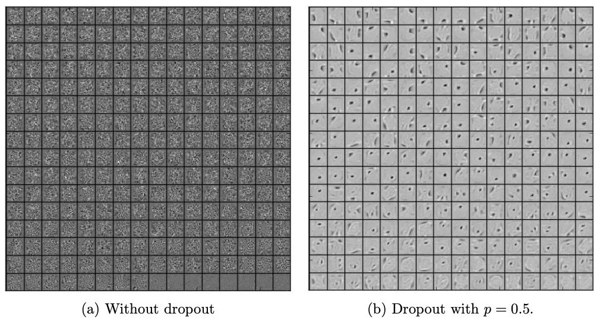

# Notes

---
**December 3, 2024**

Read the DeepMars paper (https://doi.org/10.1609/aaai.v32i1.11404) today for
the second time. It seems like the authors had this big database of images that
scientists queried. However, scientists wanted more advanced search
capabilities like searching by the content of the image(s). So the authors set
out to build HiRISENet, which is a CNN derived from AlexNet that was fine-tuned
to the HiRISE v1.0 dataset. The authors found great success in this approach
and have deployed the model to their website for scientists to use.

The authors mention that they'd release the model to the public but I've
searched all corners of the internet and have not found it. Going forward my
assumption will be that they are using AlexNet so that's what I'll baseline off
of.

Some details about the paper that will be useful for my implementation:
AlexNet was pre-trained with ImageNet earth data

classes: craters, bright sand dunes, dark sand dunes, and dark slope streaks,
other

Split dataset into train, validation, and test (80|15|15)

Epochs: 5,300
Learning Rate: 1e-4
stepsize: 20,000
Final Layer LR Multiplier: 10

link to newest dataset edition: https://zenodo.org/records/4002935

---
**December 4, 2024**

Started reading the AlexNet paper (https://doi.org/10.1145/3065386) today.

What is dropout and why does it actually work?
Well, it seems like dropout regularization helps prevent the model from
overfitting. It does this by randomly setting a subset of nodes to zero so that
they do not contribute to the training of the model. The reason this works is
because it prevents nodes from relying on other nodes to do the heavy lifting.
It forces each node to learn on its own therefore maximizing the contribution
of each node. Very interesting.

This is a figure from the dropout paper showing nodes doing individual learning

---
**December 6, 2024**

I need to refresh my memory on convolutional neural networks so I'm gonna read

* https://stanford.edu/~shervine/teaching/cs-230/cheatsheet-convolutional-neural-networks
* https://stanford.edu/~shervine/teaching/cs-230/cheatsheet-deep-learning-tips-and-tricks

One thing I was confused on was how a filter worked. Or more specifically, how
a stack of filters worked. So after reading those links my understanding is
that you can stack different filters where each filter extracts different
features of an input to a cube of outputs. That is, you can stack a horizontal
edge filter, a vertical edge filter, a diagonal filter, and produce a
feature map of the filters.

Also looking at the following links to implement LeNet5 & AlexNet from scratch:

* https://www.digitalocean.com/community/tutorials/writing-lenet5-from-scratch-in-python
* https://www.digitalocean.com/community/tutorials/alexnet-pytorch

Non-maximum suppression does this kind of "pick the best and ignore the
similar" trick for computer vision to avoid choosing the same object multiple
times.

Going down this rabit hole of 1x1 convolution trick:

https://robaita.com/blog/one-x-one-convolution/

---
**December 7, 2024**

