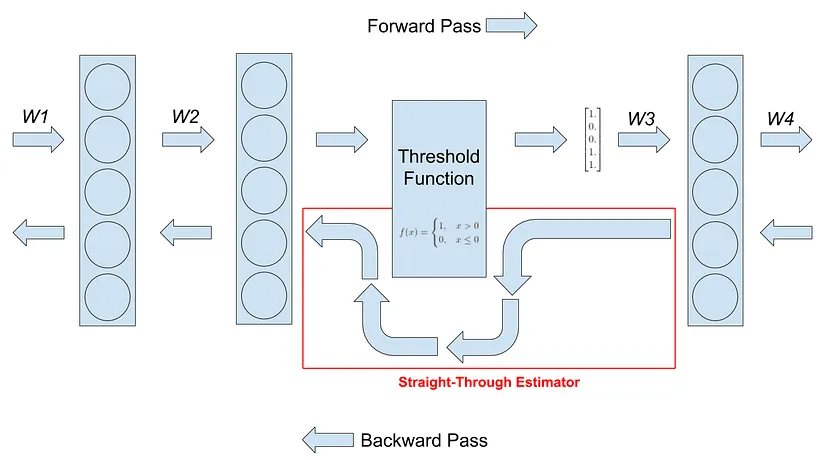

# Notes

---
**December 3, 2024**

The goal of this project is to train a classifier that is more resource
efficient than the model used by the Deep Mars authors. It doesn't have to be
_as_ good. The focus here is to learn about things like quantization and to
just have fun.

Read the DeepMars paper (https://doi.org/10.1609/aaai.v32i1.11404) today for
the second time. It seems like the authors had this big database of images that
scientists queried. However, scientists wanted more advanced search
capabilities like searching by the content of the image(s). So the authors set
out to build HiRISENet, which is a CNN derived from AlexNet that was fine-tuned
to the HiRISE v1.0 dataset. The authors found great success in this approach
and have deployed the model to their website for scientists to use.

The authors mention that they'd release the model to the public but I've
searched all corners of the internet and have not found it. Going forward my
assumption will be that they are using AlexNet so that's what I'll baseline off
of.

Some details about the paper that will be useful for my implementation:
AlexNet was pre-trained with ImageNet earth data

classes: craters, bright sand dunes, dark sand dunes, and dark slope streaks,
other

Split dataset into train, validation, and test (80|15|15)

Epochs: 5,300
Learning Rate: 1e-4
stepsize: 20,000
Final Layer LR Multiplier: 10

link to newest dataset edition: https://zenodo.org/records/4002935

---
**December 4, 2024**

Started reading the AlexNet paper (https://doi.org/10.1145/3065386) today.

What is dropout and why does it actually work?
Well, it seems like dropout regularization helps prevent the model from
overfitting. It does this by randomly setting a subset of nodes to zero so that
they do not contribute to the training of the model. The reason this works is
because it prevents nodes from relying on other nodes to do the heavy lifting.
It forces each node to learn on its own therefore maximizing the contribution
of each node. Very interesting.

This is a figure from the dropout paper showing nodes doing individual learning


---
**December 6, 2024**

I need to refresh my memory on convolutional neural networks so I'm gonna read

* https://stanford.edu/~shervine/teaching/cs-230/cheatsheet-convolutional-neural-networks
* https://stanford.edu/~shervine/teaching/cs-230/cheatsheet-deep-learning-tips-and-tricks

One thing I was confused on was how a filter worked. Or more specifically, how
a stack of filters worked. So after reading those links my understanding is
that you can stack different filters where each filter extracts different
features of an input to a cube of outputs. That is, you can stack a horizontal
edge filter, a vertical edge filter, a diagonal filter, and produce a
feature map of the filters.

Also looking at the following links to implement LeNet5 & AlexNet from scratch:

* https://www.digitalocean.com/community/tutorials/writing-lenet5-from-scratch-in-python
* https://www.digitalocean.com/community/tutorials/alexnet-pytorch

Non-maximum suppression does this kind of "pick the best and ignore the
similar" trick for computer vision to avoid choosing the same object multiple
times.

Going down this rabit hole of 1x1 convolution trick:

https://robaita.com/blog/one-x-one-convolution/

---
**December 7, 2024**


To calculate the output tensor size of a filter use the formula:
`output = (image_size - (kernel_size + 2*padding) / stride) + 1`

---
**December 9, 2024**

This is a great video to understand CNNs:
https://www.youtube.com/watch?v=pj9-rr1wDhM

This video is cool as heck:
https://youtu.be/UZDiGooFs54?si=-Ht41gi2gTlQyN85

https://youtu.be/5eqRuVp65eY?si=nLzVEEvJFxa8P7e8

---
**December 10, 2024**

Andrej Karpathy has been a huge help in just digging into the menutuae of how
a neural net works. I like the way he thinks and approaches problems.

> As a result, (and this is reeaally difficult to over-emphasize) a “fast and furious” approach to training neural networks does not work and only leads to suffering. Now, suffering is a perfectly natural part of getting a neural network to work well, but it can be mitigated by being thorough, defensive, paranoid, and obsessed with visualizations of basically every possible thing. The qualities that in my experience correlate most strongly to success in deep learning are patience and attention to detail.

https://karpathy.github.io/2019/04/25/recipe/

This will also be useful:
https://karpathy.medium.com/yes-you-should-understand-backprop-e2f06eab496b

And this to quantize the neural net:
https://github.com/cpldcpu/BitNetMCU/blob/main/docs/documentation.md

---
**December 11, 2024**

Worked on a zenodo downloaded to be able to get the dataset onto disk.
Been spending all day working on the `HiRISE` dataset class and downloading
the data. Got most of it done. I learned a couple of things about requests
and downloading from the zenodo website.

I used the official PyTorch documentation as a guide to setup my dataset class:
https://pytorch.org/tutorials/beginner/data_loading_tutorial.html#iterating-through-the-dataset

---
**December 12, 2024**

Finished putting together key parts of the `HiRISE` dataset class. It will now
load the labels based on train, val, or test. I decided to just load the exact
same split the creators of the dataset used for training their model. This
should keep things consistent and reproducible.

Okay now, how can I test this dataset class?
Got it. I just setup some pytest unit tests. I still can't get VS Code to pick
them up though?

---
**December 14, 2024**

Today I started reading the Deep Learning textbook by Ian Goodfellow et. al.
I just got through the linear algebra chapter for today. For the code, I am
just doing some literature review and learning more about the dataset. According
to Karpathy, we have to intuitively understand our data.

---
**December 16, 2024**

Reading through https://doi.org/10.48550/arXiv.2102.05011 today. This will be
my second read through. I'm mostly looking to understand a couple of concepts
for how they trained their model.


This new v3.2 dataset contains 64,947 images.
There's also these labels now:
bright dune, crater, dark dune, impact ejecta, other, slope streak, spider,
and swiss cheese.

The author's achieved an accuracy of:
{"train": 99.6%, "val": 88.6%, "test": 92.8%}
with their fine-tuned AlexNet.

What is neural net calibration? The authors use it on their AlexNet model.
This is a good source:
https://bharathpbhat.github.io/2021/04/04/getting-confidence-estimates-from-neural-networks.html

> i.i.d. = Independent and Identically Distributed

---
**December 17, 2024**

Just updating the Jupyter Notebook and clarifying my intent.

---
**December 18, 2024**

Reading "On Calibration of Modern Neural Networks" today.

---
**December 19, 2024**

Reading https://github.com/cpldcpu/BitNetMCU/blob/main/docs/documentation.md which
is a huge inspiration for this project

The author mentions the use of a straight-through estimator (STE) which is a
technique mentioned in https://arxiv.org/abs/1308.3432

We need this because the quantization functions are not differentiable so we
essentially use this hack to be able to pass backprop through. The derivative
or gradient is zero effectively nulling out any learning.



We are essentially skipping that layer.

> A trick for implementing Straight-Through-Estimator (STE) using detach()

The author also decides to use "Root Mean Square Layer Normalization" since
there were no significant benefits of BatchNorm **and** RMS Norm is more
computationally efficient.

The author also uses a cosine schedule since that provides some small
improvements over linear scheduler.

Also used these transformations:
```py
transforms.RandomRotation(degrees=10),
transforms.RandomAffine(degrees=10, translate=(0.1, 0.1), scale=(0.9, 1.1)),
transforms.Resize((16, 16)),  # Resize images to 16x16
transforms.ToTensor(),
transforms.Normalize((0.1307,), (0.3081,))
```

An interesting thing mentioned by the author is that quantization to 8 bits or
greater didn't bring major benefits. Seems like 4 bits is the sweet spot.

AlexNet Model Size: 233.081 MB


I wanna use https://pytorch.org/vision/main/models/generated/torchvision.models.convnext_tiny.html
https://medium.com/augmented-startups/convnext-the-return-of-convolution-networks-e70cbe8dabcc
https://arxiv.org/pdf/2201.03545
